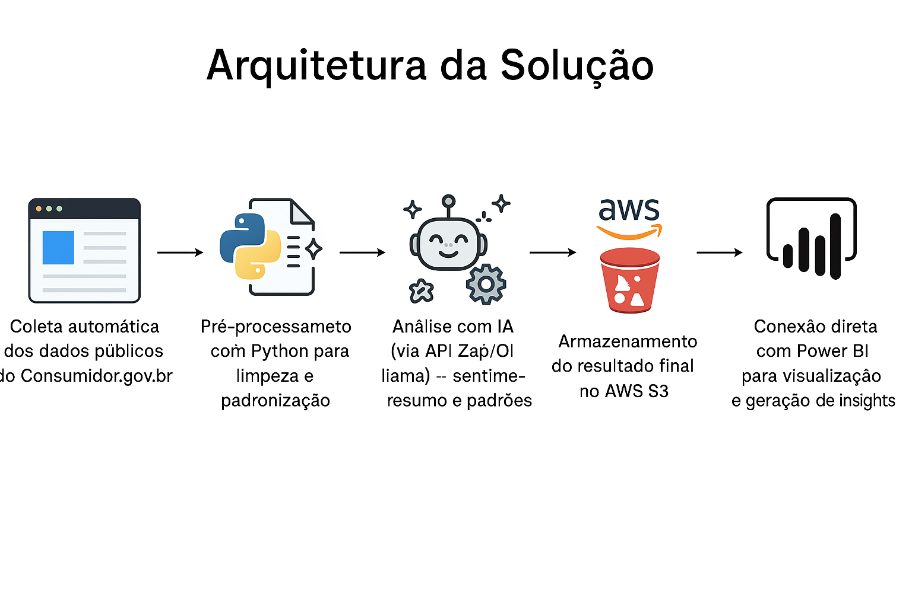

# 📊 Análise Inteligente de Reclamações com IA e BI

Este projeto apresenta uma solução completa para análise de reclamações públicas, utilizando ferramentas modernas de Ciência de Dados, Inteligência Artificial (LLMs) e Business Intelligence (BI).

---

## 🚀 Objetivo

Extrair insights valiosos a partir de dados públicos do portal [Consumidor.gov.br](https://www.consumidor.gov.br), automatizando as etapas de:

- Coleta de dados  
- Tratamento e padronização  
- Análise com modelos de linguagem (LLMs)  
- Visualização em dashboard interativo (Power BI)

---

## 📐 Arquitetura da Solução



---

## 🗂️ Estrutura do Projeto

```plaintext
projeto-2/reclamacoes-ia/
├── dados/                        # Arquivos de entrada brutos
│   └── basecompleta.csv          # Base original coletada do consumidor.gov.br
├── reclamacoes/                  # Diretório principal dos scripts
│   └── script/
│       ├── coleta_dados.py       # Script para download automatizado dos dados
│       ├── limpeza_transformacao.py # Script para limpeza e pré-processamento
│       ├── analise_llm.py        # Script que envia dados para análise com IA
│       ├── dados_tratados/       # Dados limpos e normalizados
│       ├── requirements.txt      # Dependências do projeto
├── resultados/                   # Arquivos finais processados, prontos para o BI
│   └── resultado_analise_incremental.csv
├── imagem/                       # Imagens e dashboard
│   ├── imagens-arquitetura.png   # Arquitetura da solução
│   └── grafico-BI.pbix           # Dashboard Power BI (uso local)
├── llama_env/                    # Ambiente virtual Python (não versionado)
├── .gitignore
├── LICENSE
└── README.md                     # Documentação do projeto

---

## ✅ Etapas Concluídas

### 1️⃣ Coleta dos Dados

- Fonte: Portal oficial [Consumidor.gov.br](https://www.consumidor.gov.br)  
- Download automatizado via script Python  
- Armazenamento local para inspeção e testes

### 2️⃣ Limpeza e Transformação

- Remoção de colunas irrelevantes  
- Padronização textual (minúsculas, remoção de espaços extras)  
- Tratamento de valores ausentes  
- Normalização de nomes de colunas (sem acentos, lowercase, underscores)  
- Garantia das colunas obrigatórias:

  - `empresa`, `regiao`, `procurou_empresa`, `satisfacao`, `assunto`, `indice_solucao`

### 3️⃣ Processamento com IA (LLM)

- Integração com a API da [Zapper.to](https://zapper.to), baseada no Ollama  

**Aplicações:**  
- Análise de sentimento  
- Resumo automático das reclamações  
- Identificação de padrões  

**Colunas geradas no CSV final:**  
- `sentimento_llm`  
- `resumo_llm`  
- `padrao_identificado`  

### 4️⃣ Armazenamento em Nuvem (AWS S3)

-- Upload do arquivo final para o bucket S3:

  `s3://teste-diogo-upload/resultados/resultado_analise_incremental.csv`

### 5️⃣ Dashboard Power BI

- O dashboard foi criado no Power BI Desktop e está disponível para uso local no repositório.

**Arquivo:** `imagem/grafico-BI.pbix`
> 🆕 Arquivo atualizado em 2025-06-09 para refletir corretamente os dados finais do pipeline de análise.

**Instruções:**

- Faça o download do arquivo `.pbix`
- Abra com o Power BI Desktop (versão gratuita)
- Explore as visualizações interativas baseadas nos dados processados

**Principais visualizações:**

- 📍 Volume de reclamações por região, estado e cidade  
- 🏢 Empresas com maior número de reclamações  
- 💬 Temas mais frequentes (assuntos)  
- 😊 Análise de sentimentos por empresa e região  
- 📈 Tendência temporal de reclamações por mês  
- 🧠 Padrões recorrentes identificados pela IA  
- ✅ Índice de solução e nível de satisfação  

> ⚠️ A publicação do dashboard no Power BI Service (nuvem) não foi possível devido a limitações técnicas. O uso local é a forma recomendada para exploração dos dados.

---

## 🗂️ Checklist Final de Entrega

- [x] Coleta de dados automatizada  
- [x] Armazenamento em nuvem (S3)  
- [x] Processamento com LLM (análise de sentimento, padrões, resumo)  
- [x] Dashboard criado no Power BI Desktop  
- [x] Arquivo `.pbix` incluso no repositório  
- [x] Arquitetura da solução documentada  
- [x] README completo e atualizado  
- [x] Controle de versão com commits no GitHub  

---

## 📜 Licença

Este projeto está licenciado sob a Licença MIT - veja o arquivo [LICENSE](LICENSE) para detalhes.

---

## 👨‍💻 Autor

**Diogo**  
GitHub: [https://github.com/Crelier51](https://github.com/Crelier51)

---

