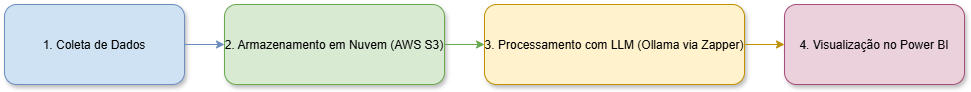

# 📊 Análise Inteligente de Reclamações com IA e BI

Projeto completo de análise de dados baseado em reclamações públicas do [Consumidor.gov.br](https://dados.consultaspublicas.com.br/), integrando ferramentas de **coleta automatizada**, **armazenamento em nuvem (AWS S3)**, **processamento com IA (LLM)** e visualização em **Power BI**.

---

## ✅ Etapas Concluídas

### 1. Coleta de Dados
- Fonte: [Consumidor.gov.br](https://dados.consultaspublicas.com.br/)
- Script: `coleta_dados.py`
- Status: ✅ Concluído

### 2. Armazenamento em Nuvem (AWS S3)
- Bucket: `teste-diogo-upload`
- Estrutura:
  - `reclamacoes/`: dados brutos e tratados
  - `resultados/`: análises geradas pela IA
- Status: ✅ Concluído

### 3. Processamento com LLM (Ollama via Zapper)
- Funções:
  - Análise de sentimentos
  - Geração de resumos
  - Identificação de padrões
- Script: Pipeline que lê e grava no S3
- Arquivo gerado: `resultado_analise_incremental.csv`
- Status: ✅ Concluído

### 4. Integração com Power BI
- Conexão direta com o S3 (AWS)
- Visualizações desenvolvidas:
  - Gráfico de linha: ano x volume de reclamações
  - Filtros por segmento de mercado
  - Tabela com análise de sentimentos
- Arquivo: `grafico-BI.pbix`
- Status: ✅ Concluído

---

## 📂 Estrutura dos Arquivos no Repositório

```
├── coleta_dados.py                   # Script de coleta da base original
├── limpeza_transformacao.py         # Script de limpeza e pré-processamento
├── gera_amostra.py                  # Gera amostra com subset da análise final
├── resultado_analise_amostra.csv    # Exemplo de saída com subset
├── resultado_analise_incremental.csv# Arquivo completo com análise da IA
└── grafico-BI.pbix                  # Visualização no Power BI
```

---

## 🧱 Arquitetura da Solução



---

## 🔜 Próximos Passos

1. Refinar visualizações no Power BI  
2. Adicionar filtros e segmentações (região, empresa, assunto)  
3. Incluir tendência temporal e análises da IA  
4. Criar e publicar o diagrama da arquitetura da solução  
5. Tornar o dashboard público (opcional)  

---

## 🎯 Objetivo

Construir uma solução moderna de **análise de reclamações públicas**, combinando ciência de dados, cloud computing, BI e LLMs (modelos de linguagem).

---

## 🗂️ Tecnologias Utilizadas

- **Python**  
- **AWS S3**  
- **Ollama (Zapper.to API)**  
- **Power BI**  
- **Git/GitHub**  

---

## 🧠 Análises da IA

A IA foi utilizada para:

- Identificar o **sentimento** de cada reclamação  
- Detectar **padrões e tópicos recorrentes**  
- Gerar **resumos automáticos** para facilitar a leitura  

---

## 📌 Sobre

Este projeto faz parte de um desafio prático com prazo de 14 dias, com o objetivo de construir uma pipeline de dados inteligente do início ao fim.

---

## 📎 Contato

Diogo Crelier  
[LinkedIn](https://www.linkedin.com/) *(link opcional para portfólio ou rede)*
